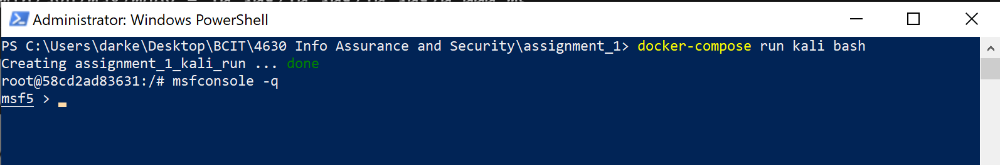

# Markdown for Assignment 1
### Student: JiaJun Cai
### Student#: A00980088

Assignment Link: [Click Here](https://bcit1.gitlab.io/acit-4630/a-1.html)



## Q&A

### 1. Assuming you don't know anything about the target machine, how do you find the IP and ports of running services on this network.
When scanning hosts, [Nmap](https://nmap.org/download.html) can use server names, IPV4 addresses or IPV6 addresses. A basic Nmap command will produce information about the given host.
```
nmap subdomain.server.com
```
```
nmap 192.168.0.1
```
### 2. What are the running services, IPs and Ports?
There're 2 common ways to know what service is running on a particular port in linux:
```
lsof -i :port -S
```
```
netstat -a | grep port
```
### 3. What is the auxiliary module for msf, how did it help you in this lab?
In metasploit any module that is not an exploit is an auxiliary module. This feature allows it to extend for a variety of purposes other than exploitation.

### 4. What is the output of `show databases`;
Actually this command didn't work as it promote a login and I don't have the credential of mysql.

### 5. What is the purpose of a Dockerfile
An instruction to let the machine knows how to bulid the container. Like a metadata file.

### 6. Add the contents of your Dockerfile
```
FROM kalilinux/kali-rolling
RUN apt-get update -y
RUN apt-get install net-tools
RUN apt-get install metasploit-framework -y
CMD bash
```

### 7. What is the purpose of a docker-compose file.
The Compose file is a YAML file defining services, networks and volumes. 

### 8. Add the contents of your docker-compose file.
```
version: '3'
services:
  kali:
    build: .
  target:
    image: tleemcjr/metasploitable2:latest
```
